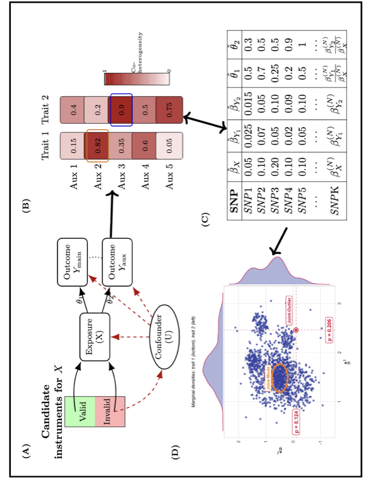

# IBMR

`IBMR` is an R package for instrument borrowing in Mendelian randomization
(MR) using summary-level genetic association data.

The motivating setting is one in which a primary outcome may share overlapping
valid instruments, or similar mechanisms of instrument invalidity, with one or
more related auxiliary outcome traits for a given exposure. `IBMR` provides
tools to identify such auxiliary traits and to incorporate them into robust MR
analyses.

The package currently provides three main functions:

- `coheterogeneity_Q()` for coheterogeneity-based auxiliary trait screening
- `IBMODE()` for multidimensional mode-based estimation with instrument borrowing
- `IBPRESSO()` for MR-PRESSO with an auxiliary trait

## Overview

Mendelian randomization is widely used to estimate causal effects of exposures
on outcomes using genetic variants as instrumental variables. Standard MR
methods can lose power or become biased when many candidate instruments are
invalid. `IBMR` addresses this problem by leveraging related outcome traits that
share informative heterogeneity structure with the primary outcome.

The typical workflow is:

1. Assemble SNP-level summary statistics for the exposure, the primary outcome,
   and one or more candidate auxiliary outcomes.
2. Use `coheterogeneity_Q()` to quantify coheterogeneity between the primary
   outcome and each auxiliary trait.
3. Select the most informative auxiliary trait.
4. Carry the selected auxiliary trait into `IBMODE()` or `IBPRESSO()` for
   downstream robust MR analysis.

## Graphical Overview



The figure summarizes the conceptual workflow implemented in `IBMR`.

- Panel A illustrates the motivating MR setting with valid and invalid
  candidate instruments.
- Panel B illustrates auxiliary-trait selection using coheterogeneity.
- Panel C shows the summary-statistics inputs and ratio estimates used by the
  methods.
- Panel D illustrates the downstream joint-analysis setting used by `IBMODE()`
  and `IBPRESSO()`.

## Installation

Install from GitHub with:

```r
install.packages("devtools")
library(devtools)
devtools::install_github("achatto4/IBMR")
library(IBMR)
```

For local development:

```r
install.packages(c("MASS", "ks"))
devtools::install(".")
library(IBMR)
```

## Minimal Example

At minimum, the package expects:

- `BetaXG`: SNP-exposure associations
- `seBetaXG`: standard errors for `BetaXG`
- `BetaYG_matrix`: SNP-outcome associations
- `seBetaYG_matrix`: standard errors for `BetaYG_matrix`

Rows must correspond to the same SNPs in the same order across all objects.

```r
library(IBMR)
data("toy_ibmr_example")

cohet_res <- coheterogeneity_Q(
  BetaXG = toy_ibmr_example$BetaXG,
  BetaYG_matrix = toy_ibmr_example$BetaYG_matrix,
  seBetaXG = toy_ibmr_example$seBetaXG,
  seBetaYG_matrix = toy_ibmr_example$seBetaYG_matrix,
  F_min = 5,
  min_K_pair = 20
)

round(cohet_res$rho, 3)
cohet_res$flag
```

This returns pairwise coheterogeneity estimates between the primary outcome and
candidate auxiliary traits. The selected auxiliary trait can then be used in
`IBMODE()` or `IBPRESSO()`.

## Included Example Data

The package includes a toy dataset:

- `toy_ibmr_example`

Load it with:

```r
data("toy_ibmr_example")
names(toy_ibmr_example)
```

This example is intended to illustrate the core workflow rather than to serve
as a realistic full-scale GWAS simulation.

## Vignettes

Longer tutorials are provided in the package vignettes:

- `vignettes/auxiliary-selection.Rmd`: coheterogeneity-based screening of
  candidate auxiliary traits
- `vignettes/instrument-borrowing-workflow.Rmd`: end-to-end workflow using the
  selected auxiliary trait in `IBMODE()` and `IBPRESSO()`

These vignettes expand on the screening logic, toy data structure,
interpretation of outputs, and downstream workflow.

## Main Functions

### `coheterogeneity_Q()`

Computes pairwise coheterogeneity across traits using a guarded theoretical
delta-exact method. The returned object includes:

- `rho`
- `se`
- `z_statistic`
- `p_value`
- `K`
- `flag`

### `IBMODE()`

Performs multidimensional mode-based estimation across the primary and
auxiliary traits.

### `IBPRESSO()`

Performs MR-PRESSO with instrument borrowing using a selected auxiliary trait.

## Input Checks

Before running the package, it is good practice to confirm that:

- SNP order matches across all vectors and matrices
- alleles are harmonized across exposure and outcome traits
- standard errors are finite and positive
- weak instruments are handled appropriately
- missing data are addressed consistently

## Citation

If you use this package in applied work, please cite the repository and the
relevant associated method paper.
