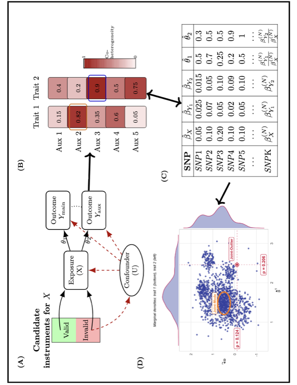

# IBMR

`IBMR` is an R package for instrument borrowing in Mendelian randomization (MR)
using summary-level genetic association data. When a primary outcome shares
overlapping valid instruments, or similar mechanisms of instrument invalidity,
with a related auxiliary outcome for a given exposure, `IBMR` uses the auxiliary
outcome to improve the robustness and efficiency of causal-effect estimation for
the primary outcome.

The package provides three functions:

- `coheterogeneity_Q()` — screens candidate auxiliary outcomes by quantifying
  their coheterogeneity with the primary outcome.
- `IBMODE()` — mode-based instrument-borrowing estimator (primary estimator).
- `IBPRESSO()` — MR-PRESSO-based instrument-borrowing estimator (secondary
  estimator).

## Overview

Mendelian randomization estimates the causal effect of an exposure on an outcome
using genetic variants as instrumental variables. Standard MR methods can lose
power or become biased when many candidate instruments are invalid. `IBMR`
mitigates this by borrowing information from a related auxiliary outcome that
shares heterogeneity structure with the primary outcome. The analysis proceeds
in two stages: candidate auxiliary outcomes are first screened with the
coheterogeneity statistic, and the selected auxiliary outcome is then carried
into the instrument-borrowing estimators.

## Graphical overview



## Installation

Install from GitHub with:

```r
install.packages("devtools")
devtools::install_github("achatto4/IBMR")
library(IBMR)
```

## Preparing the input data

`IBMR` operates on harmonized, summary-level instrument–trait associations.
Prepare the inputs as follows; where a step is also handled by
`coheterogeneity_Q()`, the relevant argument is noted.

1. **Instrument selection.** Select independent instruments for the exposure by
   linkage-disequilibrium clumping and genome-wide-significance thresholding
   (for example, `p < 5e-8` with `r^2 < 0.001`). Clumping and thresholding are
   performed externally; `coheterogeneity_Q()` additionally removes weak
   instruments through its `F_min` (first-stage F statistic) and `bx_min`
   arguments.
2. **Harmonization.** For the primary outcome and every candidate auxiliary
   outcome, align the association estimates to the exposure effect allele on the
   selected instrument set and remove ambiguous (palindromic) variants. This
   must be done before calling the package; `coheterogeneity_Q()` assumes
   harmonized input.
3. **Sample overlap.** Use a two-sample design in which the exposure GWAS sample
   does not overlap the outcome GWAS samples. Overlap between the two *outcome*
   samples is corrected internally: supply bivariate LD-score-regression
   intercepts via `ldsc_intercepts` (with `use_ldsc = TRUE`) and
   `coheterogeneity_Q()` removes the induced cross-trait sampling covariance.
   The exposure–outcome non-overlap is assumed and not corrected.
4. **Sufficient heterogeneity.** Coheterogeneity is informative only when the
   exposure–outcome pairs exhibit appreciable pleiotropic heterogeneity and
   enough instruments. `coheterogeneity_Q()` enforces a minimum instrument count
   per pair via `min_K_pair` and returns a diagnostic `flag` when a pair is
   degenerate or unstable.

## Example

As a motivating illustration, one may wish to estimate the causal effect of an
exposure (for example, body mass index) on a primary outcome (for example,
coronary artery disease), borrowing instruments from a related auxiliary outcome
(for example, type 2 diabetes). The bundled dataset `ibmr_example` is a
**simulated** example of this setting — one exposure, one primary outcome, and
two candidate auxiliary outcomes — and is not real GWAS data. In the simulation
the exposure has a true positive effect on the primary outcome; `Auxiliary_1`
shares substantial invalid-instrument (pleiotropic) structure with the primary
outcome, while `Auxiliary_2` shares little.

### Step 1 — Screen candidate auxiliary outcomes with coheterogeneity

```r
library(IBMR)
data("ibmr_example")
dat <- ibmr_example

cohet_res <- coheterogeneity_Q(
  BetaXG          = dat$BetaXG,
  BetaYG_matrix   = dat$BetaYG_matrix,
  seBetaXG        = dat$seBetaXG,
  seBetaYG_matrix = dat$seBetaYG_matrix,
  F_min = 5,
  min_K_pair = 20
)

round(cohet_res$rho, 3)       # coheterogeneity of the primary outcome with each candidate
round(cohet_res$p_value, 4)   # and the significance of each estimate
#> Primary vs Auxiliary_1: rho ~ 0.70, p ~ 0   -> selected (largest coheterogeneity)
#> Primary vs Auxiliary_2: rho ~ -0.14, p ~ 0  (significant but small; uninformative)
```

Both candidates are statistically significant, but `Auxiliary_1` has by far the
largest coheterogeneity with the primary outcome, so it is selected as the
auxiliary outcome for instrument borrowing.

### Step 2 — Estimate the causal effect by instrument borrowing

The selected auxiliary outcome is carried into the instrument-borrowing
estimators. `IBMODE()` is the primary estimator; `IBPRESSO()` provides a
complementary residual-based estimator.

```r
sel <- c(dat$primary_trait, dat$recommended_auxiliary)   # "Primary", "Auxiliary_1"

# Primary estimator: mode-based instrument borrowing
ibmode <- IBMODE(
  BetaXG          = dat$BetaXG,
  BetaYG_matrix   = dat$BetaYG_matrix[, sel],
  seBetaXG        = dat$seBetaXG,
  seBetaYG_matrix = dat$seBetaYG_matrix[, sel],
  phi    = c(1, 0.5),
  n_boot = 200,
  seed   = 1
)

ibmode[, c("phi", "Estimate_Primary", "SE_Primary", "P_Primary")]
#> Estimate_Primary ~ 0.40 (recovers the true simulated effect)
```

```r
# Secondary estimator: MR-PRESSO-based instrument borrowing
ibp <- IBPRESSO(
  BetaOutcome  = "BetaOutcome",
  BetaExposure = "BetaExposure",
  BetaAux      = "BetaAux",
  SdOutcome    = "SdOutcome",
  SdExposure   = "SdExposure",
  SdAux        = "SdAux",
  data         = dat$dat_ibpresso_aux1,
  OUTLIERtest  = TRUE,
  seed         = 1
)

c(estimate = ibp$corrected_beta, se = ibp$corrected_se,
  p = ibp$p_value, n_outliers = ibp$n_outliers)
#> corrected_beta ~ 0.40 after removing the shared-pleiotropy instruments
```

Both estimators recover the true simulated effect of the exposure on the primary
outcome; `IBPRESSO()` additionally reports the instruments it flags as
pleiotropic in `ibp$outlier_idx`.

## Bundled data

```r
data("ibmr_example")
names(ibmr_example)
```

`ibmr_example` is a simulated dataset provided to illustrate the workflow; it is
not intended as a realistic full-scale GWAS simulation.

## Citation

Chattopadhyay A, Chatterjee N. *Improving Mendelian Randomization Analysis by
Instrument Borrowing from Auxiliary Outcome Traits.*
